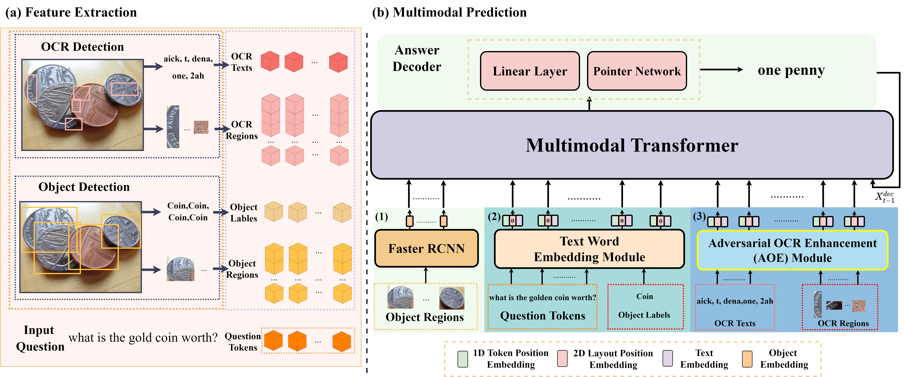

# Adversarial Training with OCR Modality Perturbation for Scene-Text Visual Question Answering
The paper was accepted by 2024 IEEE International Conference on Multimedia and Expo ([ICME](https://2024.ieeeicme.org/))

## Overview
 

## The code will be released later
